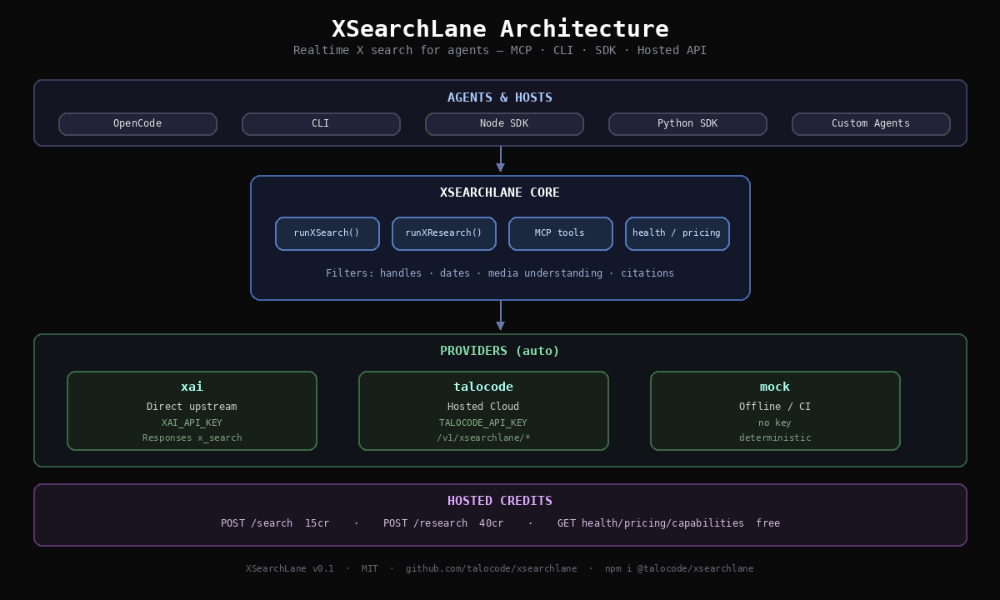

# XSearchLane

**Realtime X search for agents.**

[](https://www.npmjs.com/package/@talocode/xsearchlane)
[](https://opensource.org/licenses/MIT)

Open-source MCP server, CLI, and SDK that give coding agents live X search — keyword/semantic search, handle filters, date ranges, and citations. Run locally with your upstream key, or use hosted power on Talocode Cloud.

## Why it exists

Agents need social signal, not just static web pages. XSearchLane turns realtime X search into a first-class tool surface:

- **MCP-native** — plug into OpenCode and other agent hosts
- **Local-first** — run the open tool with your own provider key
- **Hosted path** — sell/meter usage under `/v1/xsearchlane/*`
- **Deterministic offline mode** — mock provider for tests and CI

Part of [Talocode](https://talocode.site): open tools people trust, hosted power behind them.

## Architecture



```
Agents (OpenCode / CLI / SDK)
        │
        ▼
   XSearchLane core
   runXSearch · runXResearch · MCP
        │
   ┌────┼────────────┐
   ▼    ▼            ▼
  xai  talocode     mock
(direct) (hosted)  (offline)
```

## Demo

[](https://github.com/talocode/xsearchlane/releases/download/v0.1.1/xsearchlane-demo.mp4)

Watch the demo: **[xsearchlane-demo.mp4](https://github.com/talocode/xsearchlane/releases/download/v0.1.1/xsearchlane-demo.mp4)** (release asset)

```bash
# regenerate locally
cd demo && bash make-video.sh
```

## Install

```bash
npm install -g @talocode/xsearchlane
```

Or without install:

```bash
npx @talocode/xsearchlane@latest health
```

Python:

```bash
pip install talocode-xsearchlane
```

## Quickstart

### CLI

```bash
export XAI_API_KEY=...   # direct upstream X search
# or
export TALOCODE_API_KEY=...

xsearchlane search --query "developers complaining about AI code review"
xsearchlane search --query "agent sandbox" --handles simonw,levelsio
xsearchlane research --query "AI coding agent pain points"
xsearchlane health
```

### MCP (OpenCode)

```json
{
  "$schema": "https://opencode.ai/config.json",
  "mcp": {
    "xsearchlane": {
      "type": "local",
      "command": ["npx", "-y", "@talocode/xsearchlane", "mcp"],
      "environment": {
        "XAI_API_KEY": "{env:XAI_API_KEY}"
      }
    }
  }
}
```

See [docs/MCP.md](docs/MCP.md) and [examples/opencode.json](examples/opencode.json).

### SDK

```ts
import { runXSearch, XSearchLaneClient } from '@talocode/xsearchlane'

// Local / direct provider
const live = await runXSearch({
  query: 'What are builders saying about agent memory?',
  fromDate: '2026-07-01',
})

// Hosted Talocode Cloud
const client = new XSearchLaneClient({ apiKey: process.env.TALOCODE_API_KEY })
const hosted = await client.search({ query: 'MCP server launch' })
```

## Auth / env

| Variable | Purpose |
|----------|---------|
| `XAI_API_KEY` | Direct upstream X search (Responses API `x_search`) |
| `XAI_BASE_URL` | Default `https://api.x.ai/v1` |
| `XAI_MODEL` | Default `grok-4.5` |
| `TALOCODE_API_KEY` | Hosted Talocode API |
| `TALOCODE_BASE_URL` | Default `https://api.talocode.site` |
| `XSEARCHLANE_PROVIDER` | `auto` \| `xai` \| `talocode` \| `mock` |

`auto` picks: `xai` if `XAI_API_KEY` is set, else `talocode` if `TALOCODE_API_KEY` is set, else `mock`.

## API surface

### Local engine

| Function | Description |
|----------|-------------|
| `runXSearch(options)` | Realtime X search |
| `runXResearch(options)` | Research-style brief |
| `health()` | Provider status |
| `getPricing()` / `getCapabilities()` | Metadata |

### Hosted routes (Talocode Cloud)

| Method | Path | Credits |
|--------|------|---------|
| GET | `/v1/xsearchlane/health` | 0 |
| GET | `/v1/xsearchlane/pricing` | 0 |
| GET | `/v1/xsearchlane/capabilities` | 0 |
| POST | `/v1/xsearchlane/search` | 15 |
| POST | `/v1/xsearchlane/research` | 40 |

Auth:

```
Authorization: Bearer $TALOCODE_API_KEY
```

## MCP tools

| Tool | Description |
|------|-------------|
| `xsearchlane_search` | Live X search + filters |
| `xsearchlane_research` | Theme/pain-point research brief |
| `xsearchlane_health` | Health + active provider |
| `xsearchlane_capabilities` | Feature matrix |
| `xsearchlane_pricing` | Credit table |

## CLI

```bash
xsearchlane search --query "..." [--handles a,b] [--exclude c] [--from YYYY-MM-DD] [--to YYYY-MM-DD]
xsearchlane research --query "..."
xsearchlane health | pricing | capabilities
xsearchlane mcp
```

## Architecture

```
Agent (OpenCode / CLI / SDK)
        │
        ▼
   XSearchLane
   ┌──────────────────────────┐
   │ MCP · CLI · SDK · HTTP   │
   └────────────┬─────────────┘
                │
     ┌──────────┼──────────┐
     ▼          ▼          ▼
   xai       talocode     mock
 (direct)   (hosted)   (offline)
```

## Develop

```bash
git clone https://github.com/talocode/xsearchlane
cd xsearchlane
npm install
npm run build
npm test
npm run mcp
```

## Related packages

| Package | Install |
|---------|---------|
| XSearchLane (this package) | `npm i @talocode/xsearchlane` · `pip install talocode-xsearchlane` |
| XProLane | `npm i @talocode/xprolane` · `pip install talocode-xprolane` |
| SearchLane | `npm i @talocode/searchlane` · `pip install talocode-searchlane` |
| StackLane | `pip install talocode` |

## Talocode ecosystem

| Product | Repo | Notes |
|---------|------|-------|
| [XSearchLane](https://github.com/talocode/xsearchlane) | `talocode/xsearchlane` | **(this package)** realtime X search MCP/API |
| [XProLane](https://github.com/talocode/xprolane) | `talocode/xprolane` | X Pro setup & signal dashboard planner |
| [SearchLane](https://github.com/talocode/searchlane) | `talocode/searchlane` | Agent web search & research |
| [Tera](https://github.com/talocode/tera) | `talocode/tera` | Hosted writing/coding capability API |
| [Codra](https://github.com/talocode/codra) | `talocode/codra` | Coding agent runtime |
| [StackLane](https://github.com/talocode/stacklane) | `talocode/stacklane` | Cloud control plane, keys, wallet |
| [GateLane](https://github.com/talocode/gatelane) | `talocode/gatelane` | Policy / gate tooling |
| [ContextLane](https://github.com/talocode/contextlane) | `talocode/contextlane` | Context infrastructure |
| [ScreenLane](https://github.com/talocode/screenlane) | `talocode/screenlane` | Screen/agent UI tooling |
| [MemoryLane](https://github.com/talocode/memorylane) | `talocode/memorylane` | Memory for agents |
| [Tradia](https://github.com/talocode/tradia) | `talocode/tradia` | Trading tooling |
| [DevTool](https://github.com/talocode/devtool) | `talocode/devtool` | Developer utilities |
| [Agent Browser](https://github.com/talocode/agent-browser) | `talocode/agent-browser` | Browser automation API |
| [InvoiceLane](https://github.com/talocode/invoicelane) | `talocode/invoicelane` | Invoicing |
| [GeoLane](https://github.com/talocode/geolane) | `talocode/geolane` | Geo visibility |
| [ClipLoop](https://github.com/talocode/cliploop) | `talocode/cliploop` | Short-form video loop |

More: [github.com/talocode](https://github.com/talocode) · [talocode.site](https://talocode.site) · [docs.talocode.site](https://docs.talocode.site)

## Links

- GitHub: https://github.com/talocode/xsearchlane
- npm: https://www.npmjs.com/package/@talocode/xsearchlane
- Docs: https://docs.talocode.site
- API base: `https://api.talocode.site`

## License

MIT © Talocode
